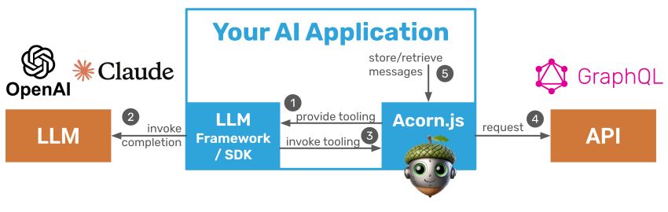

# Acorn.js: LLM Tooling from GraphQL APIs

Acorn.js is a lightweight library that analyzes GraphQL APIs/queries and creates LLM tools from the available endpoints. Use Acorn.js to enable chatbots, agents, and other LLM applications to call GraphQL APIs for data retrieval and persistence.

Acorn.js provides the following features:

- Converts GraphQL Schemas (introspected or provided) to LLM tools (i.e. tooling definitions in JSON schema) that are supported by all popular LLMs (OpenAI, Anthropic, Google, Llama, etc.)
- Direct integration with LLM SDKs (e.g. OpenAI) and agentic frameworks (e.g. LangChain)
- Manages tool calling, schema validation, and data fetching
- Supports chat history persistence and retrieval through GraphQL API for Chatbots
- Extensible and modular to adjust it to your needs (e.g. bring your own query executor)

[//]: # "* Sandboxing for sensitive information (e.g. secrets, session ids) that cannot be passed to LLMs"

In short, Acorn.js eliminates boilerplate code when building chatbots and agents that interact with APIs. It integrates GraphQL APIs with LLMs in a small library that you can extend to suit your needs.



## Getting Started

### Installation

Install Acorn.js package to your local machine:

```
npm i @datasqrl/acorn
```

You can use both `require` and `import` syntax in your TypeScript or JavaScript project:

```typescript
const { createToolsFromApiUri } = require("@datasqrl/acorn");
// or
import { createToolsFromApiUri } from "@datasqrl/acorn";
```

### OpenAI Example

This example uses Acorn.js with the OpenAI SDK to build a ChatBot that can answer questions about Ricky&Morty by retrieving data from the show's GraphQL API:

```js
//Create LLM tools from GraphQL API with Acorn.js
const llmTools = await createToolsFromApiUri({
  graphqlUri: "https://rickandmortyapi.graphcdn.app/",
  enableValidation: true,
});
//This is all standard OpenAI completions code to process the message
const messages: ChatCompletionMessageParam[] = [];
const userRequest: ChatCompletionMessageParam = {
  role: "user",
  content: "Show top 3 characters from location Earth (C-137)",
};
messages.push(userRequest);

const openai = new OpenAI();
const response = await openai.chat.completions.create({
  model: "gpt-4o",
  messages,
  tools: toOpenAiTools(llmTools),
});
messages.push(response.choices[0].message);

// Process tool calls with Acorn.js and return
const functionCallResultMessages = await createOpenAiToolResults(
    response.choices[0].message,
    llmTools,
);
messages.push(...functionCallResultMessages);
//Get final response from OpenAI
const final_response = await openai.chat.completions.create({
  model: "gpt-4o",
  messages,
});
printMessage(final_response.choices[0].message);
```

Acorn.js integrates with the following LLM SDKs and frameworks:

- [Integration with `openai` package](./examples/openai)
- [Integration with `@langchain/langgraph`](./examples/langchain)
- [Integration with `@anthropic-ai/sdk` package](./examples/anthropic-ai)

Click on the links above to see full examples of Acorn.js with each framework.

### Generic Example

Acorn.js converts GraphQL APIs to tools that can be used with all popular LLMs and agentic frameworks.

The example below shows how to convert a GraphQL schema to tools that you can pass to an LLM for invocation.

```typescript
import { convertSchema } from "@datasqrl/acorn";
// load your graphQL schema from somewhere
const graphQlSchemaString = "...";
// You need to implement `APIQueryExecutor` interface to query and validate APIQuery
// Or use existing `FetchApiQueryExecutor` provided by package
const apiExecutor = new MyApiQueryExecutor();

// your functions are here
const functions = convertSchema(graphQlSchemaString, apiExecutor);
```

Integration with your preferred LLM or agentic framework requires two steps:

1. Map the `functions` to the tooling definition that the framework expects.
2. Execute the function to produce a result that gets passed back to the LLM after tool invocation.

The integrations listed above provide this functionality out of the box. Check out the [OpenAI](src/modules/openai) or [LangChain](src/modules/langchain) module implementations for examples of how to implement those 2 steps.

### Specific Feature Examples

- [Convert single GraphQL operation to a tool](./examples/convert-operation): Defining GraphQL queries and operations gives you complete control over the API call for each tool definition.

- [Store/Retrieve chat history via GraphQL API](./examples/chat-persistence/): Use a GraphQL API to store and retrieve the message history for ChatBot-style applications to preserve context between questions.

- [Hide sensitive API parameters for safety](/): Sandbox the LLM by declaring sensitive parameters and making them inaccessible to the LLM.

- [Custom API Executor](./examples/custom-query-executor): Control how the GraphQL API gets called by implementing a custom API executor.

- [Full control over tool creation](./examples/custom-query-executor): If introspection is not available, you can provide the GraphQL schema directly. You can also adjust how the tools are created.

### Agentic Application Examples

Take a look at the [Oil & Gas Diagnostic Agent](examples/oil-gas-automation) for a complete application that diagnoses abnormal sensor readings for industrial machines autonomously and uses Acorn.js to retrieve related IoT data for diagnostics.

## Documentation

Acorn.js consists of the following packages:

- [Tool](src/tool): Defines the tool definition classes and interfaces
- [Converter](src/converter): Implements the core functionality of traversing a GraphQL schema or operation and creating corresponding tool definitions.
- [API](src/api): Defines the interfaces and classes for API call execution and a default executor.
- [Chat](src/chat): Implements saving and retrieving chat messages from a GraphQL API.
- [Utils](src/utils): Utility methods and objects used by the other packages.

In addition, Acorn.js provides the following modules for native integrations with LLM SDKs and frameworks:

- [OpenAI](src/modules/openai)
- [Anthropic](src/modules/openai)
- [LangChain](src/modules/langchain)

## Contributing

We love contributions. Open an issue if you encounter a bug or have a feature request. See [CONTRIBUTING.md](./CONTRIBUTING.md) for more details.
